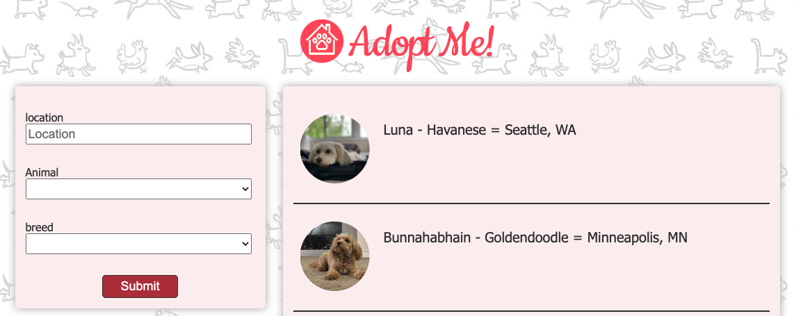
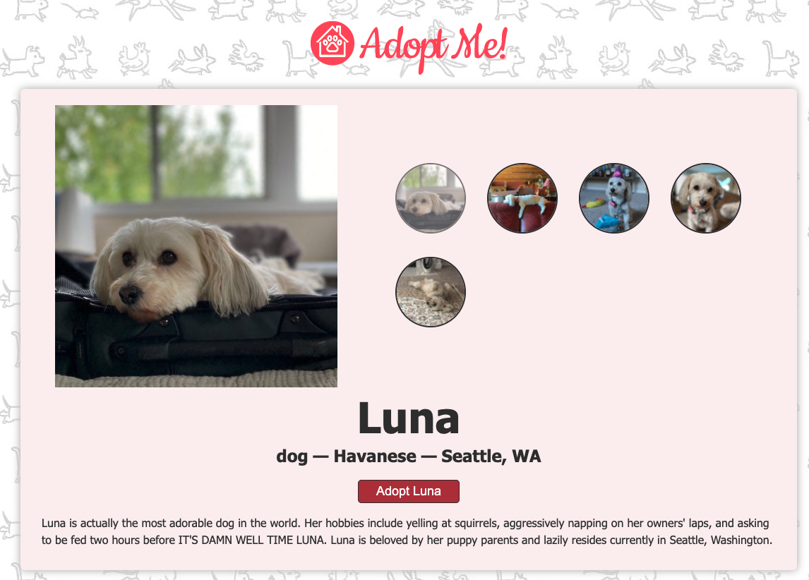
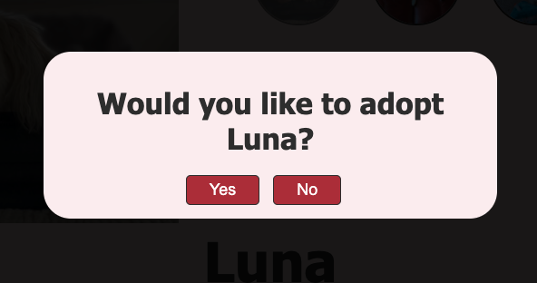

# Complete Intro To React, v6
https://frontendmasters.com/courses/complete-react-v6/

Learn to build real-world applications using modern React! Much more than an intro, you’ll start from the ground up, getting to using the latest features in React, including hooks, effects, context, and portals. Throughout the course, you’ll piece together tools from the entire React ecosystem (like Parcel, ESLint, Prettier, and React Router) to build a complete application to browse adoptable pets!

